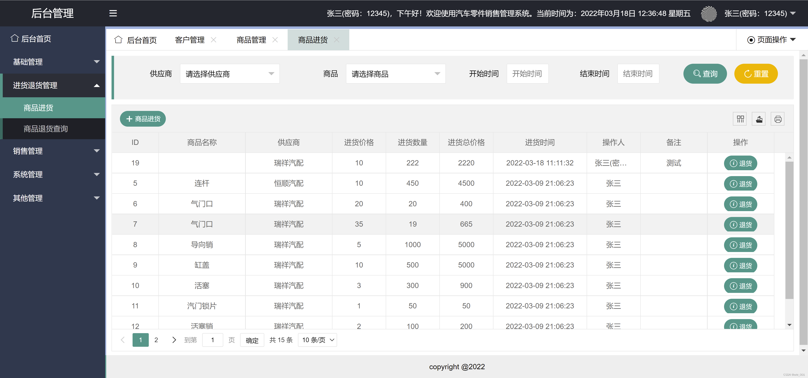
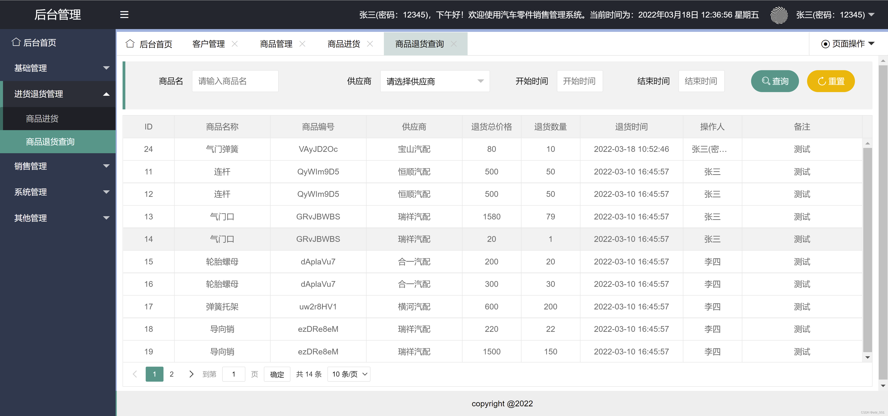
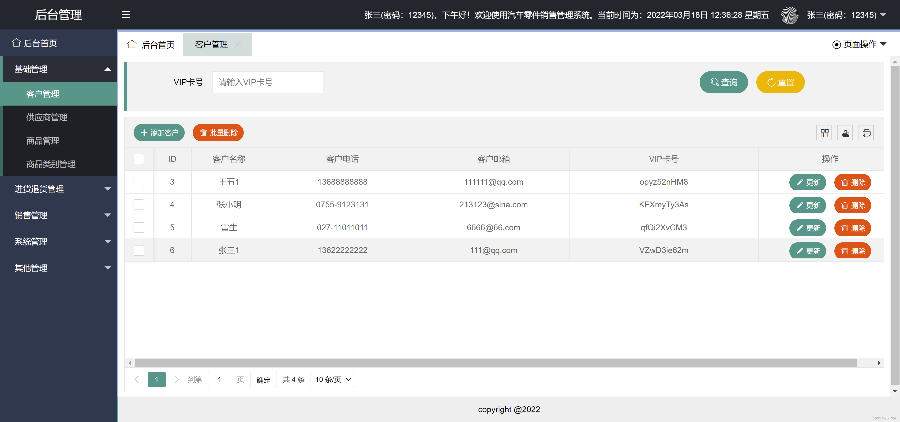
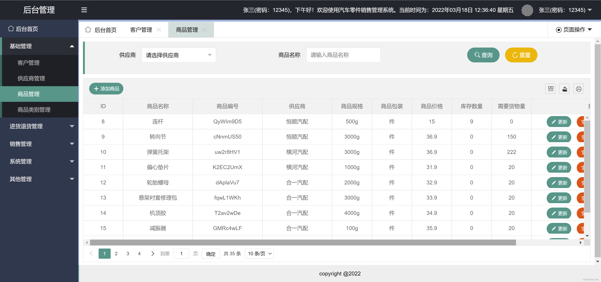
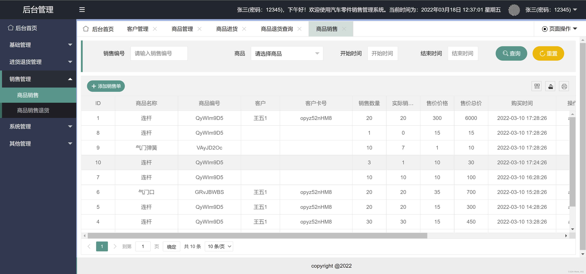
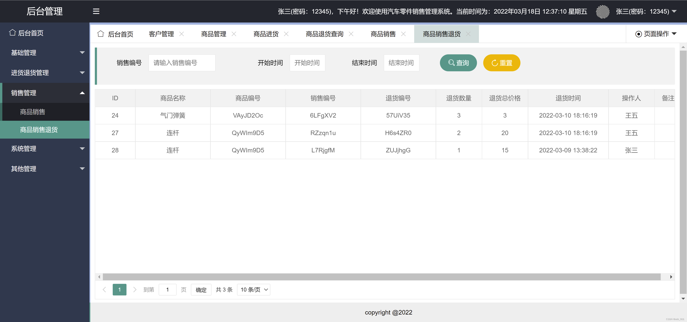

# 基于SSM的汽车零件销售管理系统设计与实现

#### 介绍
前端：HTML+JavaScript+CSS；
后台：SSM；
数据库：MySQL；
#####  汽车零件销售系统基于SSM框架开发，开发工具使用IDEA，结合MySQL数据库做数据存储，前端使用HTML+JavaScript+CSS等，本系统具有五个功能模块:基础管理部分包括客户管理、供应商管理、商品类别管理和商品管理；进退货管理部分包括商品进货和商品退回查询；销售管理包括商品销售和商品销售退货；系统管理部分包括权限管理、角色管理和用户管理；其他管理部分主要包括系统日志管理。

#### 需求分析
    汽车零件销售系统分为基础管理模块、采购管理模块、销售管理模块和系统管理四大管理模块。下面就从不同模块对系统需求进行详细分析。
#####  基础管理模块
1.  客户管理：系统管理员可在系统添加、更新、查询客户信息，并支持单条和批量删除客户信息；
2.  供应商管理：系统管理员可在系统添加、更新、查询供应商信息，并支持单条和批量删除供应商信息；
3.  商品管理：系统管理员可在系统添加、更新、查询商品信息，并支持单条删除商品信息，并可将商品进行分配类别；
4.  商品类别管理：系统管理员可在系统添加、更新、查询商品类别信息，并支持单条和批量删除商品类别信息； 
#####  采购管理模块
1.  商品进货：系统管理员可在系统内添加进货单添加进货信息，并可根据不同参数查询进货信息，并支持对进货商品进行退货操作；
2.  商品退货查询：系统管理员可在系统内根据不同查询参数对系统内所有的退货信息进行查询；
#####  销售管理模块
1.  商品销售：系统管理员可在系统内添加销售单添加销售信息，并可根据不同参数查询销售信息，并支持对销售商品进行退货操作；
2.  商品销售退货：系统管理员可在系统内根据不同查询参数对系统内所有的退货信息进行查询； 
#####  系统管理模块
1.  权限管理：系统管理员可查看系统内所有的权限列表；
2.  角色管理：系统管理员可添加、修改和删除系统角色，并未角色配置不同的操作权限；
3.  用户管理：系统管理员可添加、修改、删除 系统用户信息，并可为用户配置不同系统角色；
4.  日志管理：系统管理员可查看系统内所有的操作日志记录；

#### 系统截图

1.  
2.  
3.  
4.  
5.  
6.  
7.  

#### 需要源码请加微信：945130012（请备注来意，谢谢）
